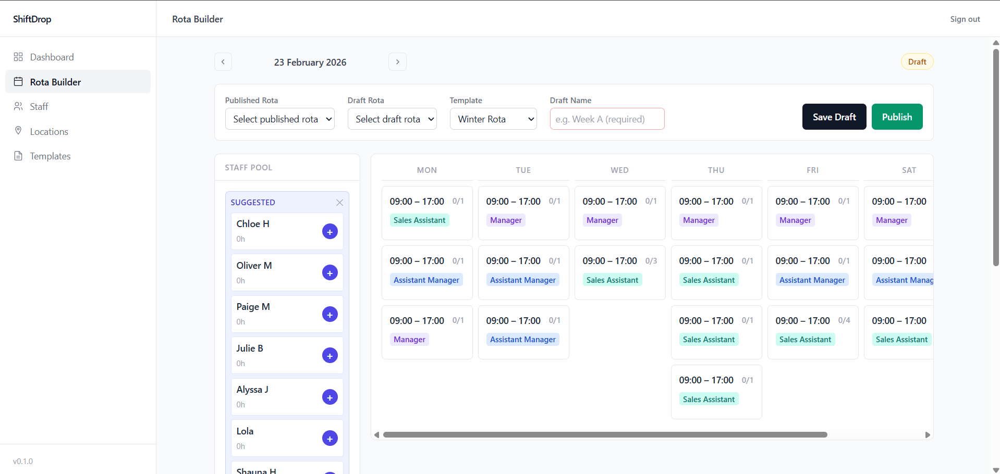

# ShiftDrop

A full-stack workforce scheduling and rota management platform built for hospitality and retail businesses. Managers can build weekly rotas, manage staff and locations, and publish schedules — while staff access a clean, mobile-optimised personal schedule view with no admin access.



**Link to project:** [https://shiftdrop.netlify.app/login](https://shiftdrop.netlify.app/login)

---

## Demo

A live demo is available at the link above. Use the credentials below to explore the admin panel:

| Role | URL | Username | Password |
|------|-----|----------|----------|
| Admin | `/login` | `admin` | `ShiftDrop2025` |

Once logged in you can create locations, add staff, build shift templates, and publish a weekly rota. To see the staff-facing schedule view, navigate to `/my-rota/<staffId>` — the staff ID is visible in the URL when managing a staff member, or use `/my-rota/698cbbcac9b7d6801c921427` as a demo link.

---

## Getting Started (Local)

**Prerequisites:** Node.js 18+, a MongoDB Atlas cluster (free tier works fine)

```bash
# 1. Clone the repo
git clone https://github.com/JackGer26/ShiftDrop.git
cd ShiftDrop

# 2. Install dependencies
cd backend && npm install
cd ../frontend && npm install

# 3. Configure environment variables
cp backend/.env.example backend/.env   # fill in MONGO_URI and JWT_SECRET
cp frontend/.env.example frontend/.env # set VITE_API_URL=http://localhost:5000/api

# 4. Seed the default admin account
cd backend && npx ts-node src/scripts/seedAdmin.ts

# 5. Start both servers (from project root)
cd .. && npm run dev
```

The admin panel runs at `http://localhost:5173` and the API at `http://localhost:5000`.

---

## How It's Made

**Tech used:** React 18, TypeScript, Vite, Tailwind CSS, React Router v6, Node.js, Express.js, MongoDB, Mongoose, Axios

ShiftDrop is built on a feature-colocated frontend architecture with a RESTful Node.js/Express backend. The frontend is written entirely in TypeScript and organised into self-contained feature modules (`rota-builder`, `staff-management`, `templates`, `locations`, `my-rota`, `dashboard`) each owning its own components, hooks, and barrel exports. Shared UI primitives live in a dedicated `ui/` layer, keeping the component tree clean and reusable.

The backend follows an MVC pattern with Express controllers, route modules, and Mongoose models. All API responses use a consistent shape, and middleware enforces published rota immutability — once a rota is published, it cannot be modified, protecting live schedules from accidental changes.

A key architectural decision was extracting all scheduling business logic into a pure domain layer (`domain/scheduling/`) completely decoupled from React, the API, and the database. This layer handles constraint validation, assignment logic, and hours calculations as plain TypeScript functions — making it independently testable and easy to extend without touching UI code.

Authentication is JWT-based with tokens stored in localStorage and attached via an Axios request interceptor. The backend validates every protected request through a dedicated `authenticate` middleware, and an expired token triggers an automatic redirect to the login page. Role separation is enforced at the routing level — staff access a dedicated `/my-rota/:staffId` route rendered outside the admin layout, meaning they never see management navigation or admin-only pages. The backend uses Zod for input validation on every endpoint, Helmet for HTTP security headers, and a rate limiter to prevent brute-force attacks.

The frontend uses Axios with a centralised API service and per-feature service modules, keeping data-fetching logic separate from component concerns. Tailwind CSS handles all styling with a desktop-first responsive strategy — the admin interface collapses to a mobile hamburger drawer on smaller screens while the staff schedule view is optimised for mobile-first use.

---

## Features

- **Rota Builder** — Drag-and-drop-style weekly schedule grid. Assign staff to shift templates per day, with real-time contracted hours warnings and hard constraint validation (max hours, role requirements, double-booking prevention). Week starts on Monday. Published rotas are locked and cannot be edited.
- **Staff Management** — Create and manage staff profiles with contracted weekly hours and role assignments. Attach staff to one or more locations.
- **Shift Templates** — Define reusable shift templates with start/end times, role requirements, and slot limits. Templates feed directly into the rota builder.
- **Location Management** — Full CRUD for business locations. Rotas and staff are scoped to locations.
- **My Rota (Staff View)** — A clean, mobile-optimised personal schedule page. Shows upcoming published shifts grouped by week, with past weeks visually separated and greyed out. Totals (hours, shifts, weeks ahead) only count active and future weeks.
- **Dashboard** — At-a-glance summary with quick-action shortcuts to all management areas.
- **Responsive UI** — Desktop-first layout with a collapsible sidebar drawer on mobile. All pages are fully usable at any viewport width.

---

## Optimizations

Scheduling logic was extracted into a pure domain layer with three distinct functions — `validateAssignment`, `calculateWarnings`, and `applyAssignment` — each with a single responsibility. This separation means validation can run without any UI or database context, dramatically simplifying testing and reducing the chance of constraint logic drifting into components.

The staff schedule view uses `useMemo` throughout to avoid redundant re-computation of week groups, `isPast` flags, and filtered totals on every render. The date range query fetches four weeks of history alongside upcoming weeks in a single API call, then the client-side sort and filter (active weeks ascending, past weeks most-recent-first, capped at four) is derived in memory with no additional requests.

Published rota immutability is enforced on the backend, not just the UI — the controller rejects any mutation attempt on a published rota with a clear error, preventing race conditions or direct API misuse from corrupting live schedules.

TypeScript strict mode is enabled throughout the frontend, catching type mismatches at compile time. Domain types (`DomainStaff`, `DomainShift`) are deliberately separate from API-facing types (`Staff`, `Rota`), with adapters at the boundary — ensuring API shape changes never silently break scheduling logic.

---

## Lessons Learned

**Domain-Driven Architecture** — Separating scheduling logic from the React layer taught me the real value of keeping business rules framework-agnostic. When the validation requirements changed, I updated one pure function rather than hunting down duplicated logic across components.

**TypeScript at Scale** — Using strict TypeScript across a multi-layer codebase (domain, services, components, API) made refactoring significantly safer. Defining separate types for domain objects vs API responses forced me to be explicit about where data transforms happen, making bugs far easier to locate.

**Role-Based Routing** — Implementing genuinely separate experiences for managers and staff — not just hiding buttons, but using entirely different route trees and layouts — reinforced how important it is to enforce access control at the structural level, not just cosmetically in the UI.

**State & Derivation** — Learning to keep server state minimal and derive everything else with `useMemo` (filtered lists, computed totals, enriched objects) made the component code cleaner and eliminated a whole class of bugs caused by derived state falling out of sync with source data.

---

## Future Improvements

- Implement push or email notifications when a new rota is published
- Add a shift swap / cover request system for staff to flag availability changes
- Build a manager approval workflow for swap requests
- Add PDF export for published rotas
- Introduce staff login so the `/my-rota` view is authenticated rather than accessed via direct URL

---

## Examples of Other Work

- [Portfolio Website](https://github.com/JackGer26/portfolio) — Modern React portfolio showcasing all projects
- [Binary Upload Boom](https://github.com/JackGer26/binary-upload-boom) — Full-stack social media app with image uploads, Cloudinary, and Passport.js authentication
- [100Jobs React Board](https://github.com/JackGer26/100Jobs) — React SPA with full CRUD functionality
